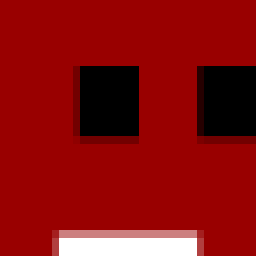

<!-- PROJECT LOGO -->
<br />
<div align="center">
  <a href="https://github.com/AchrafYndz/meat-boy">
    
  </a>

<h3 align="center">Meat Boy</h3>
  <p align="center">
    A remake of the Super Meat Boy platform game.
    <br />
    <a href="https://github.com/AchrafYndz/meat-boy/issues">Report Bug</a>
    ·
    <a href="https://github.com/AchrafYndz/meat-boy/issues">Request Feature</a>
  </p>
</div>

<!-- ABOUT THE PROJECT -->

## About The Project

<center> </center>


### Built With

<ul>
  <li style="display: flex; align-items: center; margin-bottom: 10px;">
    <p style="margin-right: 5px;">C++</p> 
  </li>
  <li style="display: flex; align-items: center; margin-bottom: 10px;">
    <p style="margin-right: 5px;">SFML</p> 
  </li>
  <li style="display: flex; align-items: center; margin-bottom: 10px;">
    <p style="margin-right: 5px;">Tiled</p> 
  </li>
  <li style="display: flex; align-items: center; margin-bottom: 10px;">
    <p style="margin-right: 5px;">Aseprite</p> 
  </li>
</ul>


<!-- GETTING STARTED -->

## Getting Started

To get a local copy up and running follow these simple steps.

### Prerequisites

- SFML
- CMake

### Installation

1. Clone the repo
```sh 
   git clone git@github.com:AchrafYndz/meat-boy.git
```
2. Build the project
```sh
   mkdir build
   cd build
   cmake ..
   make
```

### Run the game

Run the game from the meat-boy directory
```sh
  cd ..
  ./build/Game
```